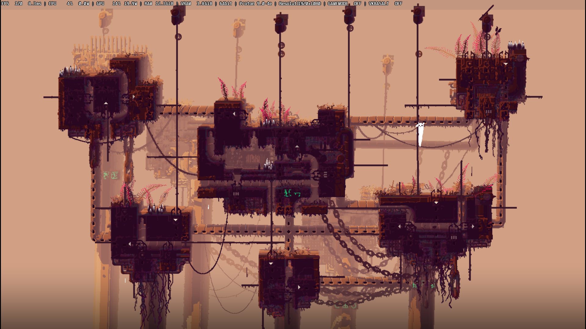
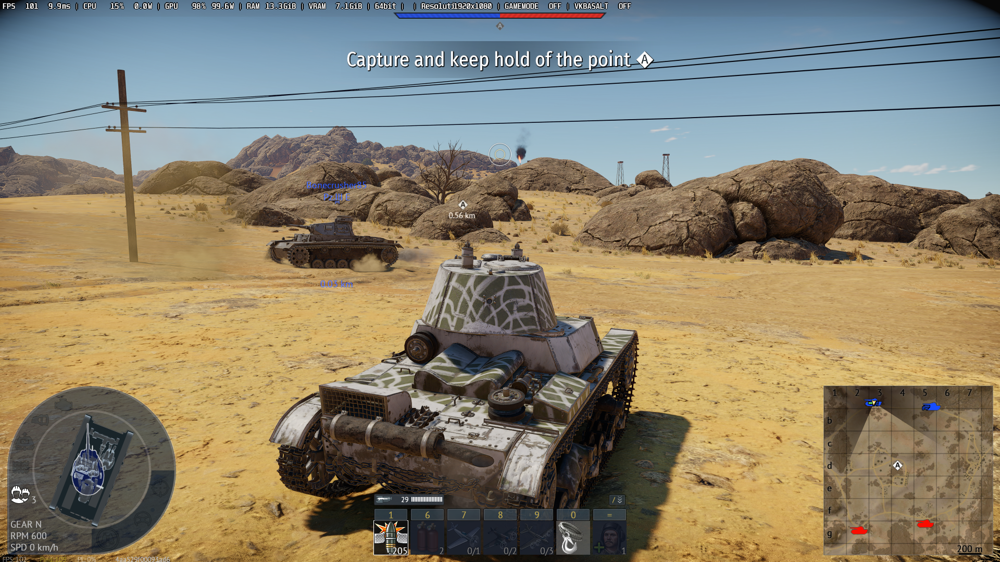
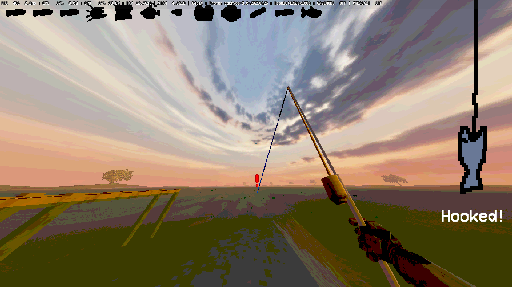

# 🍋 MangoHud Config

A simple and clean custom configuration for [MangoHud](https://github.com/flightlessmango/MangoHud) — the Vulkan/OpenGL overlay for monitoring performance in games on Linux.




<details>
<summary>📸 More Screenshots</summary>

<br>

<p align="center">
  
</p>
<p align="center">
  
</p>

</details>

## 🔧 Features

- Minimal yet informative layout

## 📦 Installation

1. Clone or download this repository:

   ```bash
   git clone https://github.com/yourusername/mangohud-conf.git
